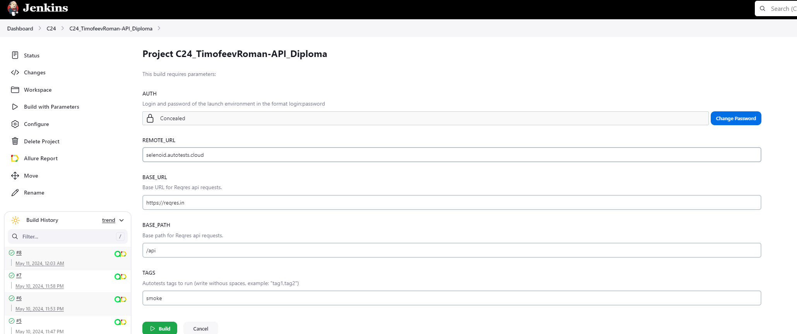
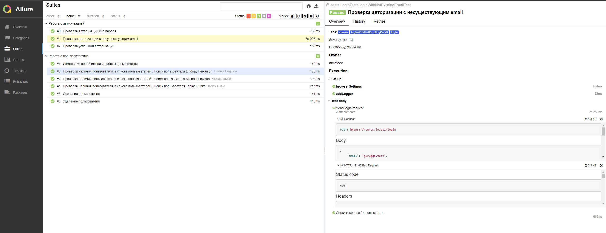
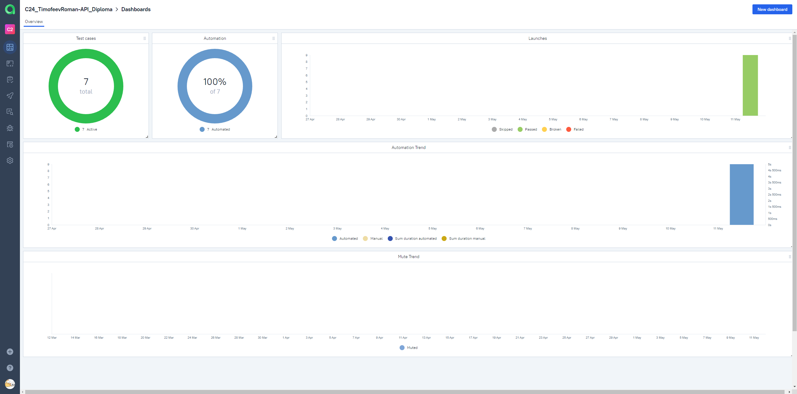
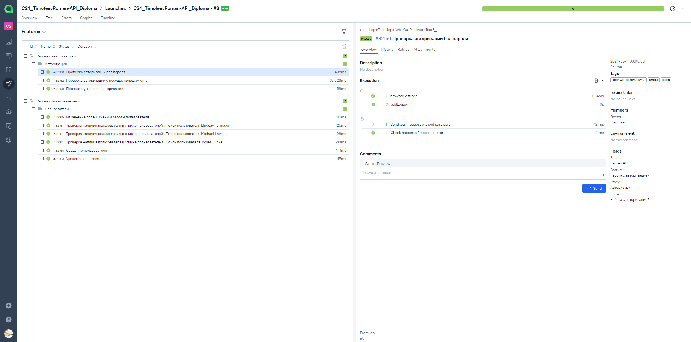
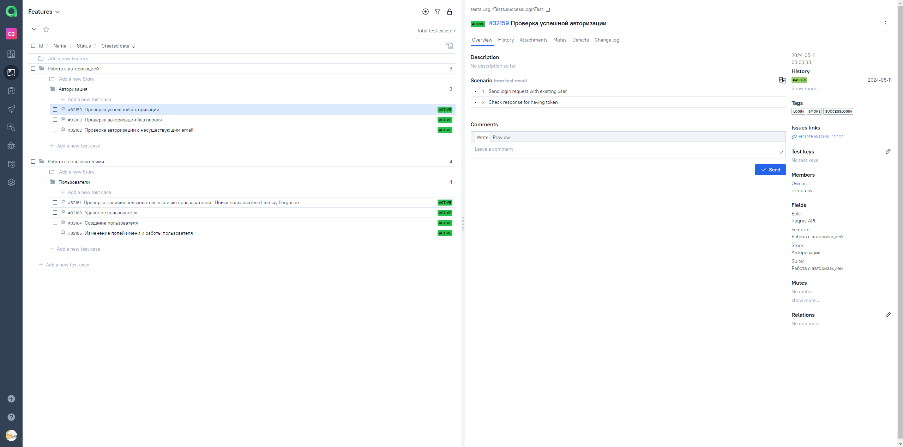
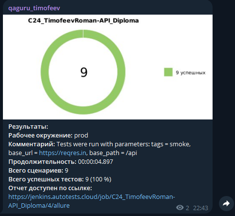

# Проект-презентация по автоматизации API тестов для сайта "Reqres.in"

<a href="https://reqres.in/"> 

## :clipboard: Содержание:

- <a href="#tools"> Стек используемых технологий</a>
- <a href="#checking"> Реализованные проверки</a>
- <a href="#console"> Запуск автотестов</a>
- <a href="#jenkins"> Сборка в Jenkins</a>
- <a href="#allureReport"> Пример Allure-отчета</a>
- <a href="#allureTestOps"> Интеграция с Allure TestOps</a>
- <a href="#jira"> Интеграция с Jira</a>
- <a href="#tg"> Уведомления в Telegram с использованием бота</a>

<a id="tools"></a>
## :wrench: Стек используемых технологий

<p align="center">
<a href="https://www.w3schools.com/java/">  </a>
<a href="https://selenide.org/">  </a>
<a href="https://junit.org/junit5/">  </a>
<a href="https://gradle.org/">  </a>
<a href="https://aerokube.com/selenoid-ui/latest/">  </a>
<a href="https://docs.qameta.io/allure-testops/">  </a>
<a href="https://allurereport.org/">  </a>
<a href="https://www.atlassian.com/software/jira">  </a>
<a href="https://www.jenkins.io/">  </a>
<a href="https://web.telegram.org/">  </a>
</p>

Тесты в данном проекте написаны на языке ```Java``` с использованием фреймворка для тестирования ```Selenide```, сборщик - ```Gradle```.

```JUnit 5``` задействован в качестве фреймворка модульного тестирования.
При прогоне тестов для запуска браузеров используется ```Selenoid```.

Для удаленного запуска реализована джоба в <code>Jenkins</code> с формированием Allure-отчета и отправкой результатов в <code>Telegram</code> при помощи бота. Так же реализована интеграция с <code>Allure TestOps</code> и <code>Jira</code>.

Содержание Allure-отчета:
* Шаги теста;
* Логи запросов и ответов.

<a id="checking"></a>
## :male_detective: Реализованные проверки

Автоматизированные тесты
- ✓ Работа с пользователями (tag - users)
- - Создание пользователя
- - Изменение полей имени и работы пользователя
- - [Параметризованный тест] Проверка наличия пользователя в списке пользователей
- - Удаление пользователя
- ✓ Работа с авторизацией (tag - login)
- - Проверка авторизации без пароля
- - Проверка авторизации с несуществующим email
- - Проверка успешной авторизации

<a id="console"></a>
## :arrow_forward: Запуск автотестов

### Запуск тестов из терминала
В проекте присутствуют отдельные теги для каждого тест-сьюта (описаны выше в реализованных проверках),
с помощью которых, можно запускать не только все тесты единоразово, но и отдельно только нужные.
Применимо и при локальном и удаленном запуске.
Локальный запуск тестов по сьютам "users" без доп. параметров:
```
gradle clean withTags -Dtags=users
```
Локальный запуск всех тестов без доп. параметров:
```
gradle clean withTags
```
Удаленный запуск всех тестов с параметрами:
```
gradle clean withTags -Denv=remote -DbrowserRemoteUrl=*Remote selenoid or moon hub* -DbaseUrl=https://reqres.in -DbasePath=/api
```

<a id="jenkins"></a>
##  </a> Сборка в <a target="_blank" href="https://jenkins.autotests.cloud/view/C24/job/C24_TimofeevRoman-API_Diploma/"> Jenkins </a>

Для запуска сборки необходимо перейти в раздел ```Build with Parameters```, выбрать необходимые параметры и нажать кнопку ```Build```.
#### :hammer_and_wrench: Параметры сборки в Jenkins:
- BASE_URL (адрес базового URL продукта Reqres, по умолчанию https://reqres.in/)
- BASE_PATH (адрес базовых api endpoints продукта reqres, по умолчанию /api)
- TAGS (теги конкретных автотестов для запуска, по умолчанию smoke)
- AUTH (креды авторизации удаленной среды)
- REMOTE_URL (адрес удаленной среды)
- BROWSER_REMOTE_URL (адрес удаленного сервера для запуска)
<p align="center">

</p>

После выполнения сборки, в блоке ```Build History``` напротив номера сборки появятся значки ```Allure Report``` и ```Allure TestOps```, при клике на которые откроется страница с сформированным html-отчетом и тестовой документацией соответственно.

<a id="allureReport"></a>
##  </a> Пример <a target="_blank" href="https://jenkins.autotests.cloud/view/C24/job/C24_TimofeevRoman-API_Diploma/allure/"> Allure-отчета </a>
### Overview

<p align="center">

</p>

<a id="allureTestOps"></a>
##  </a> Интеграция с <a target="_blank" href="https://allure.autotests.cloud/project/4228/dashboards"> Allure TestOps </a>

На *Dashboard* в ```Allure TestOps``` видна статистика количества автоматизированных тестов. Новые тесты, а так же результаты прогона приходят по интеграции при каждом запуске сборки.

<p align="center">

</p>

### Результат выполнения автотеста в прогоне

<p align="center">

</p>

<a id="jira"></a>
##  </a> Интеграция с <a target="_blank" href="https://jira.autotests.cloud/browse/HOMEWORK-1222"> Jira </a>

Реализована интеграция ```Allure TestOps``` с ```Jira```, в тикете отображается, какие тест-кейсы были написаны в рамках задачи и результат их прогона.

<p align="center">

</p>

И наоборот, у тест кейсов отображается ссылка на тикет в Jira, во вкладке ```Test cases```, в поле ```Issue links```.

<p align="center">

</p>

<a id="tg"></a>
##  Уведомления в Telegram с использованием бота

После завершения сборки специальный бот, созданный в ```Telegram```, автоматически обрабатывает и отправляет сообщение с отчетом о прогоне тестов и информацией о нём. Если тесты не прошли успешно, а получили статус "Сломанный" или "Упавший" эта информация отразится в диаграмме.

<p align="center">

</p>